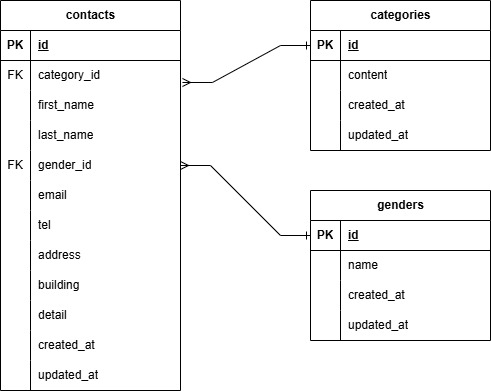

# お問い合わせフォーム

## 環境構築

### Dockerビルド
1. git clone git@github.com:takayuki345/toiawase.git
2. docker compose up -d --build

### Laravel環境構築
1. docker compose exec php bash
2. composer install
3. .env.exampleファイルから.envを作成し、環境変数を変更
4. php artisan key:generate
5. php artisan migrate
6. php artisan db:seed

## 使用技術(実行環境)
- PHP 7.4.9
- Laravel 8.83.29
- Mysql 8.0.26
- nginx 1.21.1

## ER図

## URL
- 開発環境 : http://localhost:80/
- phpMyAdmin : http://localhost:8080/

## 備考
- 「管理画面」での「エクスポート」「モーダルウィンドウ」の実装はできませんでした
- 性別の管理のために、「genders」テープルを用いることとしました
- その他にも仕様通りとならなかった箇所があります